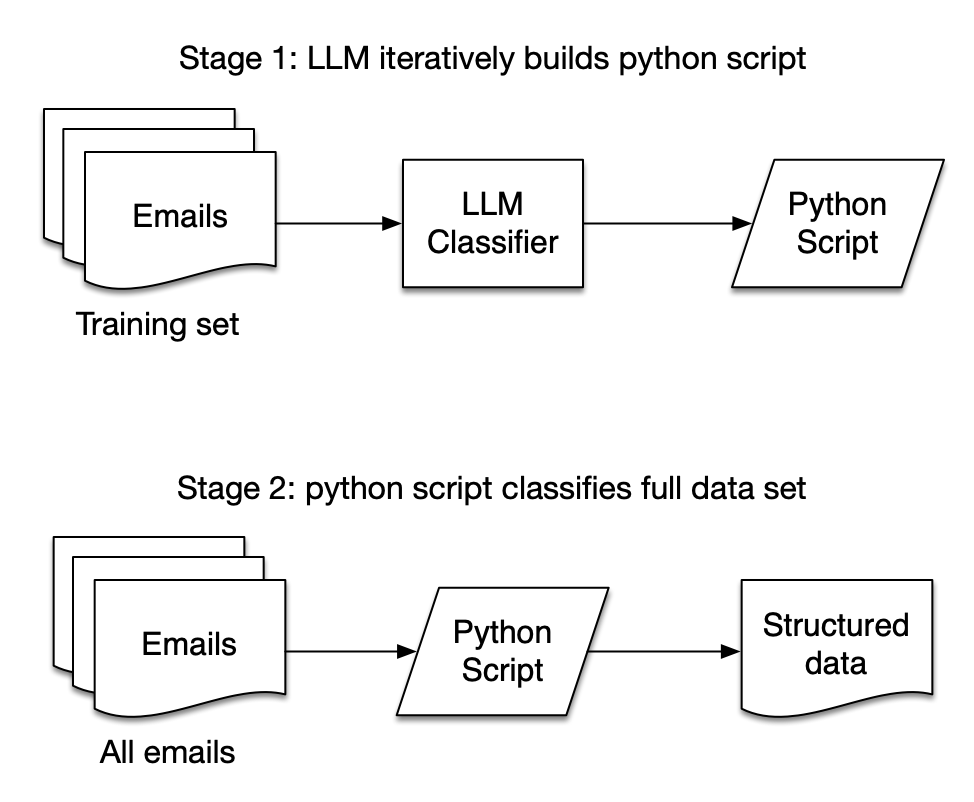

# "Training" Python code with an LLM

## The problem

I thought it would be neat if an LLM could go through all my emails and tell me all the places I've traveled to in the world by extracting the destinations from the flight itineraries.

## Set up: connecting to GMail

[LlamaHub](https://llamahub.ai) has a [GMail tool](https://llamahub.ai/l/tools/llama-index-tools-google) for use by agents. This is where I went first. You have to dance the authentication dance with Google first, however. Here's what I did:

* Created a new project in the [Google Cloud Console](https://console.cloud.google.com/)
* Went to APIs & Services -> Library and searched for GMail, then enabled that API
* Went to APIs & Services -> Credentials and created a new OAuth client ID
    * Application type: Web application
    * Authorized redirect URIs: http://localhost:8080/ (the last slash seems important)
* Went to APIs & Services -> OAuth consent screen and made the app external, which allowed me to connect my personal GMail to it once I explicitly added it as an allowed test user
* Downloaded the credentials JSON file and saved it as `credentials.json` in the root of my project

Unfortunately, the GMail tool doesn't have a way of paginating through lots of results, so I copied and modified it, which you'll find in [gmail.py](gmail.py).

## First pass: get the LLM to categorize each email

In [summarize.py](summarize.py) you can see my first attempt, where I run through every message in a search matching "your flight itinerary" and try to get the LLM to categorize it, spitting out JSON every time. This works! But it's very slow, and it also uses up hella tokens -- it could get expensive!

## Second attempt: get the LLM to generate an email categorization script

In [generate.py](generate.py) you can see my second solution: instead of running the LLM on every email, I get it to run through a subset of them. For each email, I give it the body of the email as well as a Python function whose purpose is to detect if an email body is an itinerary (this starts off just being an empty string).

If the LLM thinks the email is an itinerary, it is instructed to modify the Python function so that the email would be detected. It's also instructed to make sure the previous emails would still be detected. So it iterates, making a progressively more complicated Python function every time, that can detect more and more itineraries. This is the process:

In [sample_generated_code.py](sample_generated_code.py) you can see the output of this process after running through about 100 emails, not all of which were actually itineraries (lots of spam from airlines matches the search). You can see it's slowly iterating towards having a detection block for each individual airline, which is what I imagine I would have come up with as a human anyway, but with a lot more futzing around.

## Further work

Some next steps that have occurred to me:

* Improve the search string to exclude more spam so it gets trained on more actual itineraries (it's reading a lot of spam right now)
* Use a local model to save me money (I've been looking at `codestral`, the latest from Mistral. Meta's `llama3` wasn't able to do it.)
* Explicitly include in the prompt instructions to combine detection blocks when possible. This seems complicated! Not sure if it will be able to do that.
